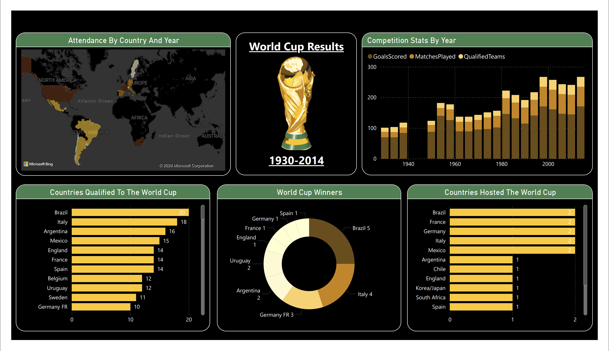

# FIFA-World-Cup-1930-2014-Dashboard

A one-page Power BI dashboard (5 visuals) on FIFA World Cup history, 1930–2014: 20 tournaments and 836 matches. Built in 2024 as a guided BCA course project by a team of two.

## What the dashboard shows

| Visual | What it shows |
|---|---|
| Attendance By Country And Year | World map of host countries, with attendance by country and year |
| Competition Stats By Year | Goals scored, matches played and qualified teams for each tournament |
| Countries Qualified To The World Cup | How many tournaments each country has qualified for |
| World Cup Winners | Titles won per nation |
| Countries Hosted The World Cup | How many times each country has hosted |

## Key numbers from the data

- **Growth:** qualified teams rose from 13 (1930) to 32 (1998–2014), matches per tournament from 18 to 64, and goals per tournament peaked at 171 (1998 and 2014).
- **Brazil:** the only team to qualify for all 20 tournaments (20 of 20) and the most titles (5). Italy is next on qualifications (18), then Argentina (16) and Mexico (15).
- **Winners:** 20 tournaments, 8 winning nations: Brazil 5, Italy 4, Germany 4, Argentina 2, Uruguay 2, England 1, France 1, Spain 1. The dashboard shows Germany as two entries ("Germany FR" 3, "Germany" 1); see Known limitations.
- **Hosts:** five nations hosted twice (Brazil, France, Germany, Italy, Mexico) and ten hosted once. The 2002 Korea/Japan co-hosting is a single entry in the data.

## Data

- **Source:** the FIFA World Cup dataset on Kaggle, covering 1930–2014.
- **Tables in the dataset:** WorldCups (20 rows, one per tournament), WorldCupMatches (852 rows for 836 unique matches) and WorldCupPlayers (37,784 rows).
- **Not covered:** tournaments after 2014, including 2018 and 2022.

## Known limitations

- **Germany is split in two.** "Germany FR" (West Germany: 3 titles, 10 qualifications) and "Germany" (1 title, 8 qualifications) appear as separate entries, so the winners and qualification charts understate Germany's record. Merged, Germany has 4 titles and 18 qualifications, level with Italy.
- **The stacked bar mixes measures.** Competition Stats By Year stacks goals, matches and qualified teams into one bar, so the total bar height (goals + matches + teams) has no meaning.
- **No slicers.** There is no year or country selector.

## Possible improvements

- Merge "Germany FR" and "Germany" into one team.
- Replace the stacked bar with separate charts for goals, matches and teams.
- Add a tournament-year slicer.

## Project context

BCA course project (CA 335 Data Visualization) at BIT Mesra, Jaipur campus, built in 2024 by Abhinav Tadi and Hardik Malik.